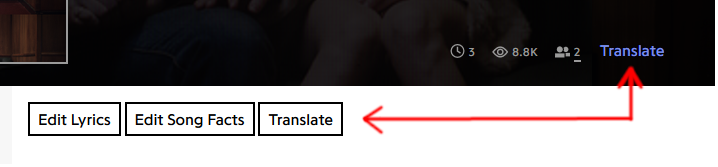
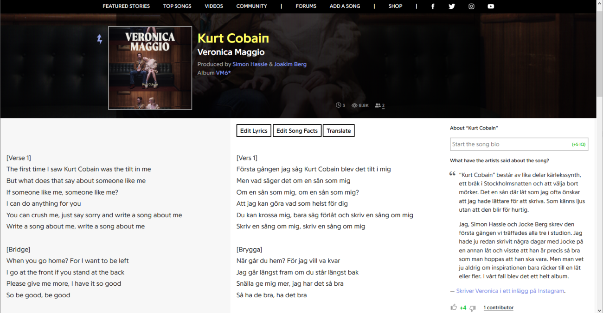

# Genius-translate-lyrics-userscript
Shows English or Russian translation next to the lyrics on [genius.com](https://genius.com)

[Powered by Yandex.Translate](http://translate.yandex.com/)

You need a API key for the Yandex Translate API.  
Register for a free API key for Yandex here: https://translate.yandex.com/developers/keys

[**Click here to install**](https://openuserjs.org/install/cuzi/Genius.com_translate_lyrics.user.js) 
Tested with Firefox/**Greasemonkey** and Chrome/**Tampermonkey**.

Screenshots:  

**Some of the supported languages:**

**English:**  
Albanian,
Belarusian,
Catalan,
Czech,
Danish,
Dutch,
Estonian,
Finnish,
French,
German,
Greek,
Hungarian,
Italian,
Latvian,
Lithuanian,
Macedonian,
Norwegian,
Portuguese,
Russian,
Slovak,
Slovenian,
Spanish,
Swedish,
Turkish,
Ukrainian

**Русский:**  
Азербайджанский,
Албанский,
Английский,
Армянский,
Белорусский,
Болгарский,
Венгерский,
Греческий,
Датский,
Испанский,
Итальянский,
Каталанский,
Латышский,
Литовский,
Македонский,
Немецкий,
Нидерландский,
Норвежский,
Польский,
Португальский,
Румынский,
Сербский,
Словацкий,
Словенский,
Турецкий,
Украинский,
Финский,
Французский,
Хорватский,
Чешский,
Шведский,
Эстонский
